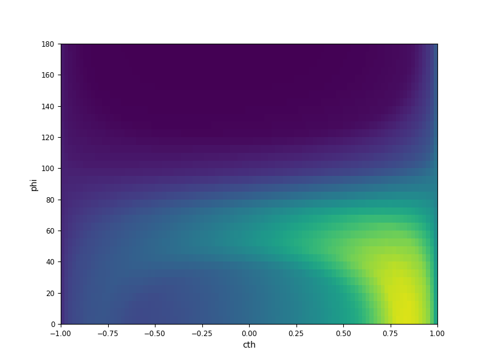

Running `mkdir -p output && python3 mwe.py` should produce the following plots and the splined data file `output/out.fits`.

Input data             |  Fitted spline
:-------------------------:|:-------------------------:
  |  
